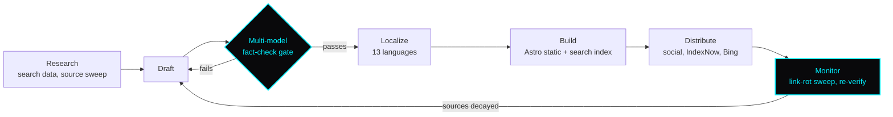

<div align="center">


**I dig into hard problems, weigh the alternatives, and ship what wins on performance and cost.**

A decade of turning complex operations into systems that scale, now pointed at software I design, build, and run end to end.

<br />

[](https://williamlwallace.com)
[](https://trendytechtribe.com)
[](mailto:Contact@williamlwallace.com)

</div>

<br />

---

## Open source

<div align="center">

[](https://github.com/hamed-elfayome/Claude-Usage-Tracker)
[](https://github.com/hamed-elfayome/Claude-Usage-Tracker/releases/tag/v3.2.0)
[](https://github.com/hamed-elfayome/Claude-Usage-Tracker)

</div>

### [Claude Usage Tracker](https://github.com/hamed-elfayome/Claude-Usage-Tracker) &nbsp;·&nbsp; credited contributor

A native macOS menu bar app in Swift and SwiftUI.

> Popover layout-recursion crash on macOS 26/27 (PR #265): native popover animation fed an unbounded layout loop; replaced with a SwiftUI entrance animation + click-race debounce. Thanks **@Leewallace017**
>
> <sub>Upstream v3.2.0 release notes</sub>

<details>
<summary><b>How that crash was found</b></summary>

<br />

Clicking the menu bar icon crashed the app with `EXC_BAD_ACCESS` on macOS 26/27. The main thread was overflowing its stack in an AppKit and SwiftUI layout loop that never converged:

```
NSPopover.show
  └─ NSHostingView.windowDidLayout
       └─ updateAnimatedWindowSize
            └─ _NSPopoverWindow.setFrame:display:
                 └─ layout   (repeats ~6,500x)  →  stack overflow
```

The popover's hosting controller used `sizingOptions = .preferredContentSize`, added earlier to fix positioning, which continuously re-pushed the SwiftUI content size into the window. Paired with `NSPopover.animates = true`, the newer SwiftUI never settled the animated resize.

The fix disables the native popover animation so the resize cannot feed the loop, while leaving the earlier sizing work intact, and replaces the motion with a SwiftUI fade and scale entrance that runs purely as a transform on a fixed-size view. A dismiss and re-open race in the click handler got a debounce on the way through.

</details>

<details>
<summary><b>In review: Keep Awake</b> (<a href="https://github.com/hamed-elfayome/Claude-Usage-Tracker/pull/282">#282</a>)</summary>

<br />

Sleep prevention so long agent runs do not die when the Mac idles. Built on a single named IOKit power assertion with one idempotent `reconcile()` owning create and release, so the kernel drops it automatically if the app exits.

- Auto mode driven by real session activity, with a configurable wind-down
- Injectable clock and assertion seams so the state machine is testable without waiting on real time
- 29 unit tests covering timer expiry, wind-down, crashed-session sweep, and persistence round-trips
- 38 localization keys across all 13 supported languages

</details>

<sub>I picked up Swift for this project. The interesting part was not the language, it was reading an unfamiliar codebase closely enough to find a bug the maintainers had been living with.</sub>

---

## What I build

### [Trendy Tech Tribe](https://trendytechtribe.com)

A technology publication covering AI, semiconductors, EVs, energy policy, and markets. Designed, built, and operated solo. The site is the visible part; most of the engineering is the pipeline behind it.



<table>
<tr><td width="50%" valign="top">

**Architecture**
Static and serverless on Astro, Vercel, and PostgreSQL with a self-hosted search index, chosen to run at near-zero fixed cost.

**Toolchain**
40+ command line tasks covering publishing, verification, translation, and distribution.

</td><td width="50%" valign="top">

**Accuracy over time**
Corpus-wide link-rot detection and scheduled re-verification, so published work stays correct as its sources decay.

**Reach and revenue**
Structured data, news sitemaps, IndexNow and Bing submission, 13-language localization, display and affiliate monetization with consent management.

</td></tr>
</table>

### [williamlwallace.com](https://williamlwallace.com)

Portfolio and personal site. Next.js 16, React 19, Tailwind 4. HMAC-signed session auth with httpOnly cookies and timing-safe comparison, serverless routes backed by Redis, and a hardened header and CSP configuration.

---

## Stack

<div align="center">


</div>

<br />

|  |  |
|---|---|
| **Frontend** | React · Next.js · Astro · SwiftUI · Tailwind CSS |
| **Backend and infra** | Node.js · Serverless · PostgreSQL · Redis · Vercel |
| **Native** | Swift · SwiftUI · AppKit · IOKit · XCTest |
| **Data** | GIS and spatial analysis · Data visualization · Analytics |
| **Practice** | System design · Performance and cost optimization · Technical SEO · Security hardening · AI-assisted development |

---

## Background

Ten years in public health and state government. Most recently leading strategic analysis and systems modernization for five statewide programs, and before that running teams and data operations for the CDC's COVID-19 response. That work is where I learned to take an operational mess apart and rebuild it as something that holds.

---

<details>
<summary><b>A note on this profile</b></summary>

<br />

Most of what I build lives in private repositories, so the contribution graph here undersells the volume. The public proof is upstream: the pull requests above, and the sites themselves, which are live and running the work described.

</details>

<br />

<div align="center">

<sub>Outside the terminal: photography, EV technology, and an ongoing argument with my own fitness data.</sub>

</div>
